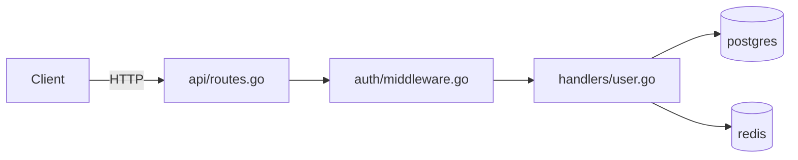
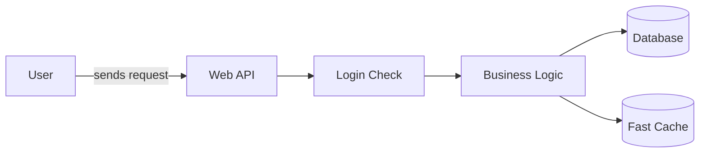

# codebase-onboarding

**Stop guessing. Build the right mental model before you break something.**

New repo. Inherited codebase. Your own code after six months away. The instinct is to start reading files until something clicks. That's slow, incomplete, and leaves you blind to the things that will actually burn you — the undocumented env var, the file everyone's afraid to touch, the test suite that breaks when run in parallel.

This skill does the archaeology. Claude runs the investigation, maps the architecture, hunts for gotchas, and generates a living `CODEBASE.md` with the questions only a teammate can answer — ranked by urgency. Then it stays useful: **touch mode** gives you a risk assessment before modifying any file, mid-PR.

---

## Four modes

| Mode | Use when |
|------|----------|
| **join** | First day on a team, inherited repo, colleague's codebase |
| **return** | Your own code you haven't touched in 3+ months |
| **audit** | Evaluating an OSS project before contributing |
| **touch** | About to modify a specific file — run before you change anything |

`touch` is ongoing. The other three are for initial orientation.

---

## The investigation

```
Phase 0   Bootstrap          README, CI config, open issues, package manifests
Phase 1   Critical Paths     Entry points, data stores, Mermaid architecture diagram
Phase 2   Conventions        What git history reveals vs. what the README claims
Phase 3   Danger Zones       High-churn files, debt clusters, frequently reverted code
Phase 4   Gotcha Detector    Undocumented env vars, pre-commit/CI gaps, test traps
Phase 5   Team Questions     Priority-ranked questions for your first 1:1
Phase 6   First Contribution Specific file + line + fix — not just a category
────────────────────────────────────────────────────────────────────────────────
Phase 7   Archaeology        return only — why decisions were made, not just what they are
Phase 8   Contributor Signal audit only — merge rate, PR velocity, go/no-go
```

---

## What you get

### `CODEBASE.md` — honest by design

Every section carries a confidence tag so you know what's evidence and what's inference:

```
✅ Verified   Based on CI config, git history, or explicit documentation
⚠️ Inferred   Based on patterns — likely but not confirmed
❓ Gap        Couldn't assess from code — needs a human answer
```

Gap sections automatically feed into Team Questions.

**Example output:**

```markdown
## Danger Zones ✅ Verified

| File / Area         | Why dangerous                         | When to touch  |
|---------------------|---------------------------------------|----------------|
| src/core/engine.go  | 2,847 lines, 47 TODOs, in 89% of PRs | After 4+ weeks |
| migrations/         | Schema changes need team coordination | Never solo     |
| auth/               | No tests, last touched 18 months ago  | With review    |

## Gotchas ✅ Verified

- `STRIPE_WEBHOOK_SECRET` required but missing from `.env.example` —
  payments fail silently without it
- Pre-commit runs `eslint --fix`; CI runs `eslint` without fix —
  code that passes locally can fail CI if you don't re-stage after the hook
- Tests in `auth/` share a singleton — `pytest -n 4` causes random
  failures; always run `pytest -p no:xdist auth/`

## Team Questions ✅ Verified

### 🔴 Blocking (ask in the first hour)
1. `STRIPE_WEBHOOK_SECRET` is in the code but not in `.env.example`.
   Shared dev key, or do I need my own Stripe account?

2. CI runs `pytest -x` but README says `make test`. Which for local dev?

### 🟡 Important (ask in your first 1:1)
3. `payments/sync.go` reverted 3× in 6 months — active fix, or avoided?

### 🟢 Nice-to-know
4. `core/engine.go` is 2,400 lines. Plan to split it, or intentional?
```

### Architecture Map — generated in Phase 1

For engineers:


For non-technical stakeholders — same investigation, plain language:


---

## Touch mode

After initial onboarding, run before modifying any file:

> *"I'm about to modify `auth/middleware.go` — run touch mode."*

```
Before You Touch: auth/middleware.go

Risk level: HIGH — this file is in your Danger Zones list

Recent commits:
  3 days ago   fix: token expiry edge case         alice@example.com
  2 weeks ago  REVERT: "refactor auth flow" — broke staging
  1 month ago  fix: race condition in session validation

Who to ping: alice@example.com (14 of the last 20 commits here)

Known issues:
  Line 47   TODO  refresh token rotation not implemented
  Line 203  FIXME breaks with multiple active sessions

Tests that cover this:
  tests/auth/middleware_test.go
  tests/integration/session_test.go

Watch out for:
  Session singleton on line 89 has non-obvious global state —
  this is what caused the revert two weeks ago
```

---

## `CODEBASE.md` doesn't go stale

The skill includes staleness detection commands — run them when the codebase feels like it's drifted. They check whether Danger Zones were modified since the last update, whether CI changed (new conventions), and whether new large files appeared that aren't mapped yet.

`CODEBASE.md` is also a team artifact. The next person who joins uses the same document. It gets more valuable as it grows.

---

## Works for everyone

Before any phase runs, Claude asks two questions:
- **Technical or non-technical?** — engineers get file paths and code snippets; PMs, designers, and execs get plain language and a diagram they can share in a meeting
- **What's your goal?** — determines which phases run and how deep

The same skill works for a developer taking ownership of a new service and a product manager trying to understand what the team is building before a roadmap conversation.

---

## Install

```bash
mkdir -p ~/.claude/skills/codebase-onboarding
curl -o ~/.claude/skills/codebase-onboarding/SKILL.md \
  https://raw.githubusercontent.com/googlarz/codebase-onboarding/main/SKILL.md
```

---

## Usage

```
/codebase-onboarding join     # new team or repo
/codebase-onboarding return   # your own code after months away
/codebase-onboarding audit    # evaluating OSS before contributing
/codebase-onboarding touch    # before modifying a file mid-ramp
```

---

## Contributing

See [CONTRIBUTING.md](CONTRIBUTING.md).
