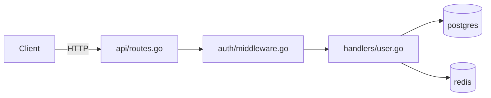
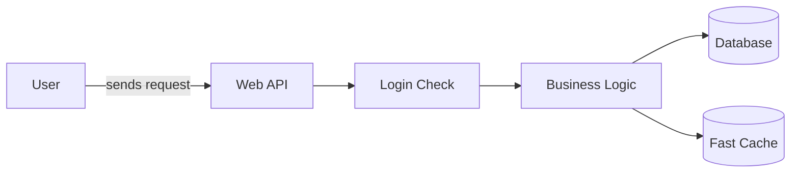

# codebase-onboarding

**Stop guessing. Build the right mental model before you break something.**

New repo. Inherited codebase. Your own code after six months away. The instinct is to start reading files. That's slow, incomplete, and leaves you blind to the things that will actually burn you — the undocumented env var, the file everyone avoids, the test suite that breaks when run in parallel.

This skill does the archaeology. Claude runs the investigation, maps the architecture, hunts for gotchas, generates a working local dev guide, and produces a living `CODEBASE.md`. Then it stays useful: check a file before touching it, catch problems before pushing, map a ticket to the codebase before writing a line.

---

## Six modes

| Mode | Use when |
|------|----------|
| **join** | First day on a team, inherited repo, colleague's codebase |
| **return** | Your own code you haven't touched in 3+ months |
| **audit** | Evaluating an OSS project before contributing |
| **touch** | About to modify a specific file — get a risk assessment first |
| **preflight** | About to push a PR — catch what reviewers will catch, before review |
| **task** | Assigned a ticket or feature — map it to the codebase before starting |

`touch`, `preflight`, and `task` are ongoing — they require an existing `CODEBASE.md`.

---

## The investigation

```
Phase 0   Bootstrap          README, CI config, open issues, package manifests
Phase 1   Critical Paths     Entry points, data stores, Mermaid architecture diagram
Phase 2   Conventions        What git history reveals vs. what the README claims
Phase 3   Danger Zones       High-churn files, debt clusters, frequently reverted code
Phase 4   Gotcha Detector    Undocumented env vars, pre-commit/CI gaps, test traps
Phase 5   Local Dev Guide    Step-by-step to get it running — real commands, common failures  [technical]
Phase 6   Team Questions     1:1 format with priority tiers  [technical]
          Meeting Questions  Sprint planning / roadmap / board framing  [non-technical]
Phase 7   Executive Brief    One-page health summary in business language  [non-technical]
Phase 8   First Contribution Specific file + line + fix — not just a category  [technical]
────────────────────────────────────────────────────────────────────────────────────────
Phase 9   Archaeology        return only — why decisions were made, not just what they are
Phase 10  Contributor Signal audit only — merge rate, PR velocity, go/no-go
```

---

## Works for technical and non-technical users

Before any phase runs, Claude asks two questions:

**1. Technical or non-technical?**

- **Technical:** file paths, code snippets, git commands, local dev guide, PR preflight
- **Non-technical:** plain language throughout, shareable architecture diagram, executive brief, questions framed for meetings — not for debugging sessions

**2. What's your goal?**

- **Technical examples:** make a contribution, take ownership, security review, evaluate OSS
- **Non-technical examples:** understand what the system does, assess risk before a launch, prepare for a roadmap or board conversation

The same investigation runs either way. The output is completely different.

---

## What you get

### `CODEBASE.md` — honest by design

Every section carries a confidence tag:

```
✅ Verified   Based on CI config, git history, or explicit documentation
⚠️ Inferred   Based on patterns — likely but not confirmed
❓ Gap        Couldn't assess from code — needs a human answer
```

Gap sections automatically become Team Questions. If something is tagged ❓, there's a corresponding question to ask.

**Example sections:**

```markdown
## Danger Zones ✅ Verified

| File / Area         | Why dangerous                         | When to touch  |
|---------------------|---------------------------------------|----------------|
| src/core/engine.go  | 2,847 lines, 47 TODOs, in 89% of PRs | After 4+ weeks |
| migrations/         | Schema changes need team coordination | Never solo     |
| auth/               | No tests, last touched 18 months ago  | With review    |

## Gotchas ✅ Verified

- `STRIPE_WEBHOOK_SECRET` required but absent from `.env.example` —
  payments fail silently without it
- Pre-commit runs `eslint --fix`; CI runs `eslint` — passes locally,
  fails CI if you don't re-stage after the hook fires
- `auth/` tests share a singleton — `pytest -n 4` causes random failures;
  always run `pytest -p no:xdist auth/`

## Local Dev Guide ✅ Verified

1. `cp .env.example .env`
2. Set missing variables:
   - `STRIPE_WEBHOOK_SECRET` — ask alice@example.com for the dev key
   - `JWT_SECRET` — any 32-char string works locally
3. `npm install`
4. `docker-compose up -d postgres redis`
5. `npm run db:migrate`
6. `node scripts/seed.sh`   ← not in README; required for tests
7. `npm run dev`            → http://localhost:3000

Verify: `curl http://localhost:3000/health` → `{"status":"ok"}`
```

### Architecture Map — generated in Phase 1

For engineers:


For non-technical stakeholders — same investigation, plain language:


### Team Questions — prioritised

**For technical users (1:1 format):**
```markdown
### 🔴 Blocking (ask in the first hour)
1. `STRIPE_WEBHOOK_SECRET` is in code but not `.env.example`. Shared dev key?
2. CI runs `pytest -x`, README says `make test`. Which for local dev?

### 🟡 Important (this week)
3. `payments/sync.go` reverted 3× in 6 months — active fix, or avoided?

### 🟢 Nice-to-know
4. `core/engine.go` is 2,400 lines — plan to split it, or intentional?
```

**For non-technical users (meeting format):**
```markdown
### For your next sprint planning
- The payment module has broken 3 times this year — what's the risk
  if we ship features that touch it this sprint?

### For a board or investor conversation
- How would you describe the overall health of the engineering foundation?
```

### Executive Brief — non-technical only

```markdown
## Executive Brief

### Codebase health
| Area | Status | Business impact |
|------|--------|----------------|
| Core engine | 🔴 High risk | Changes here are slow and bug-prone |
| Payments | 🟡 Unstable | Has broken 3× in 6 months |
| Auth | 🟡 Untested | No safety net; bugs affect all users |
| API | 🟢 Healthy | Well-maintained, stable |

### Top risks
1. Payment processing has broken and been reverted three times — any change
   here carries meaningful risk of customer-facing outage.
2. Authentication has no automated tests — bugs affect every user.

### Overall assessment
Medium risk. The API layer is healthy, but two critical areas (payments
and auth) need investment before safely shipping major new features.
```

---

## Touch mode

> *"I'm about to modify `auth/middleware.go` — run touch mode."*

```
Before You Touch: auth/middleware.go

Risk level: HIGH — listed in Danger Zones

Recent commits:
  3 days ago   fix: token expiry edge case       alice@example.com
  2 weeks ago  REVERT: "refactor auth flow" — broke staging

Who to ping: alice@example.com (14 of last 20 commits)

Known issues:
  Line 47   TODO  refresh token rotation not implemented
  Line 203  FIXME breaks with multiple active sessions

Watch out for:
  Session singleton on line 89 — caused the revert two weeks ago
```

---

## Preflight mode

> *"Run preflight on my current changes."*

```
PR Pre-flight: feat/add-rate-limiting

✅ Commit message follows conventional commits format
✅ No Danger Zone files in the diff
⚠️  auth/middleware.go touched — alice@example.com should review
❌ No test changes for modified source files (convention: every commit touches tests)
⚠️  payments/ touched — re-stage after pre-commit hook (eslint --fix vs CI eslint)

Suggested reviewers: alice@example.com, bob@example.com

Overall: ⚠️ ADDRESS BEFORE PUSHING
  → Add tests for changed files
  → Re-stage after pre-commit hook fires
```

---

## Task mode

> *"I need to add rate limiting to the API — where do I start?"*

```
Task: Add rate limiting to the API

Relevant files:
  api/routes.go       — entry point; where rate limiting hooks in
  api/middleware.go   — existing pattern to follow ← start here

Danger Zone proximity:
  auth/middleware.go  ⚠️  adjacent — avoid unless necessary

Similar past work:
  "feat(api): add request logging middleware" — bob@example.com, 3 months ago
  Same pattern: middleware.go, not routes.go

Conventions:
  Every new middleware needs an integration test in tests/api/

Who to loop in: bob@example.com (owns api/, built existing middleware)

Risk level: LOW — api/ is not a Danger Zone, pattern is established
```

---

## Install

```bash
mkdir -p ~/.claude/skills/codebase-onboarding
curl -o ~/.claude/skills/codebase-onboarding/SKILL.md \
  https://raw.githubusercontent.com/googlarz/codebase-onboarding/main/SKILL.md
```

---

## Usage

```
/codebase-onboarding join       # new team or repo
/codebase-onboarding return     # your own code after months away
/codebase-onboarding audit      # evaluating OSS before contributing
/codebase-onboarding touch      # before modifying a file
/codebase-onboarding preflight  # before pushing a PR
/codebase-onboarding task       # when starting any new piece of work
```

---

## Contributing

See [CONTRIBUTING.md](CONTRIBUTING.md).
