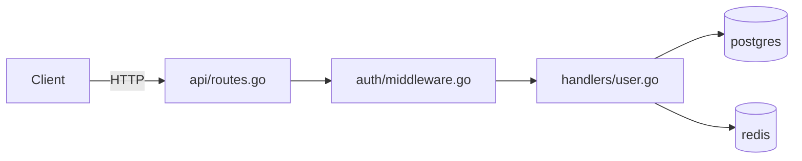
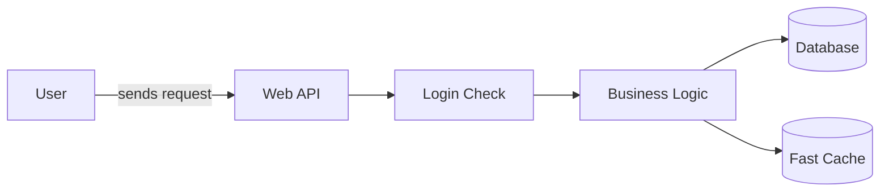

# Codebase Onboarding

Systematic orientation. Stop guessing. Build the right mental model before
touching anything — then keep it live as you work.

**How this works:** Claude runs the investigation — executes commands, reads
files, traces paths — and writes CODEBASE.md as a living orientation document.
The human provides the repository and answers questions that can't be found in
the code. Think of it as pair programming where Claude does the archaeology and
you provide context that only humans have.

---

## When to Use

| Situation | Mode |
|-----------|------|
| Joining a new team or repo for the first time | **join** |
| Returning to your own code after 3+ months away | **return** |
| Evaluating an OSS project before contributing | **audit** |
| Inheriting a colleague's codebase | **join** |
| Doing due diligence on an acquisition or dependency | **audit** |
| About to modify a specific file or area mid-ramp | **touch** |

Default to **join** if unclear. Ask the user which mode if the context is ambiguous.

**touch** is not an onboarding mode — it's ongoing use after the initial
session. See [Touch Mode](#touch-mode-before-you-modify-anything) below.

---

## Intake: Ask First

Before running any phase, ask two questions in sequence. The answers reshape every phase that follows.

### Question 1: Technical profile

Ask:

> "Are you a developer who can read code and run terminal commands, or are you
> non-technical — a PM, designer, analyst, or executive who needs to understand
> the system without diving into the code itself?"

Then explain the difference so the user can answer accurately:

> **If you're technical:** I'll run shell commands, read source files, trace
> execution paths, and map git history. The output will include code snippets,
> file paths, and technical conventions — things you can act on directly.
>
> **If you're non-technical:** I'll still run all the same investigation, but
> I'll translate everything into plain language. No code in the output — just
> what the system does, what's risky, and what you need to know to make
> decisions or have informed conversations with engineers. I'll also generate
> a visual diagram of how the system fits together.

---

### Question 2: Goal

Wait for the answer to Question 1, then ask about their goal — and tailor the examples to match their profile.

**If technical:**

> "What are you trying to do with this codebase? For example:
> - Make a contribution or fix a specific bug
> - Take ownership — become the go-to maintainer
> - Review it for quality, security, or architecture concerns
> - Evaluate an open-source project before contributing
> - Get up to speed quickly after being away for months"

**If non-technical:**

> "What do you need to understand about this codebase? For example:
> - What the system actually does and how it fits together
> - Whether the team is building the right thing
> - How risky or stable it is before a launch, acquisition, or vendor decision
> - What's holding the team back or slowing them down
> - How to have a more informed conversation with the engineers building it"

---

**Why both questions matter:**

| Profile + Goal | What changes |
|----------------|-------------|
| Technical + contribute | Full workflow including Phase 6 (first safe contribution) |
| Technical + own/maintain | Full depth; extra attention to Danger Zones and authorship |
| Technical + review | Phases 0–4 with security/quality lens; skip Phase 6 |
| Technical + evaluate OSS | audit mode — contributor signal, merge rate, PR velocity |
| Non-technical + understand | Phases 0–4; plain language output; Mermaid diagram in Phase 1 |
| Non-technical + decide | Phases 0–4 + written recommendation section in CODEBASE.md |
| Non-technical + evaluate | audit mode in plain language; go/no-go framing in output |

Never assume. A non-technical executive evaluating an acquisition needs a completely different output than a developer taking over a repo.

---

## Phase Order by Mode

Modes change which phases run and in what order. Don't follow join order for return.

| Phase | join | return | audit |
|-------|------|--------|-------|
| 0 — Bootstrap | ✓ first | ✓ first | ✓ first |
| 1 — Critical Paths | ✓ | ✓ | ✓ |
| 2 — Conventions | ✓ | ✓ after Phase 7 | ✓ |
| 3 — Danger Zones | ✓ | ✓ after Phase 7 | ✓ |
| 4 — Gotcha Detector | ✓ | ✓ | ✓ |
| 5 — Team Questions | ✓ | ✓ | ✓ |
| 6 — First Safe Contribution | ✓ | ✓ | skip |
| 7 — Archaeology | skip | ✓ before Phase 2 | skip |
| 8 — Contributor Signal | skip | skip | ✓ |

**In return mode:** run Phase 7 (Archaeology) immediately after Phase 1. You need
to know why decisions were made before you can evaluate whether the current
conventions are intentional or legacy drift.

---

## Output: CODEBASE.md

The skill produces and maintains a single living document. Not a one-time scan.

```
CODEBASE.md
├── What This Is          # one-paragraph system description
├── Architecture Map      # Mermaid diagram + component description
├── Critical Paths        # entry points → processing → exit
├── Conventions           # implicit rules the README doesn't mention
├── Danger Zones          # what not to touch first, and why
├── Gotchas               # what silently burns new contributors
├── Team Questions        # prioritised: blocking / important / nice-to-know
├── Open Questions        # still unclear — actively maintained
└── Contribution Log      # join/return: changes + learnings
                          # audit: merge rate, PR velocity, go/no-go
```

### Confidence calibration

Every section carries a confidence tag. Don't write sections without one.

| Tag | Meaning |
|-----|---------|
| ✅ Verified | Based on CI config, git history, or explicit documentation |
| ⚠️ Inferred | Based on patterns — likely but not confirmed |
| ❓ Gap | Couldn't assess from code alone — needs human confirmation |

Example:

```markdown
## Conventions ⚠️ Inferred

Commit style appears to be conventional commits based on the last 30 messages,
but the team has no enforced linter. A few commits in the last month broke the
pattern — unclear if intentional.
```

Gap sections feed directly into Team Questions. If you wrote ❓ on something,
there should be a corresponding question in Phase 5.

Update CODEBASE.md at the end of each phase. Do not defer.

---

## Phase 0: Bootstrap

Read these in order. Stop when you can answer the question at the bottom.

```
1. README.md / README.rst    → what does it claim to do?
2. CLAUDE.md / AGENTS.md     → what has an AI already learned here?
3. CONTRIBUTING.md           → what does the team care about?
4. package.json / go.mod /
   pyproject.toml / Cargo.toml → language, deps, run scripts
5. Makefile / justfile        → available commands
6. .github/workflows/         → what CI runs — the ground truth
```

**CI is the most honest documentation in any codebase.** It runs on every commit and
doesn't lie. If it conflicts with the README, CI wins.

```bash
# Scan in 30 seconds
ls -la && head -50 README.md
ls .github/workflows/ 2>/dev/null
grep -E "run:|script:" .github/workflows/*.yml 2>/dev/null | head -20

# Remote pulse (join/audit mode)
gh issue list --state open --limit 5 2>/dev/null
gh pr list --state open --limit 5 2>/dev/null
```

**Gate:** Write the "What This Is" section of CODEBASE.md with a confidence tag.
One paragraph. No jargon. If you can't write it confidently, you haven't read
enough — don't proceed to Phase 1.

---

## Phase 1: Map the Critical Paths

Find where data enters and leaves. Every system has 2–5 entry points. Find them.

```bash
# Entry points
find . -name "main.*" -o -name "index.*" -o -name "app.*" \
  | grep -v "node_modules\|.git\|test\|spec" | head -20

# What the system exposes
grep -rn "listen\|:8080\|:3000\|serve\|router\|@app.route" \
  --include="*.go" --include="*.ts" --include="*.py" -l | head -10

# Data stores
find . \( -name "*.sql" -o -name "schema.*" -o -type d -name "migrations" \) \
  ! -path "*/.git/*" | head -10
grep -rn "sqlite\|postgres\|mysql\|redis\|mongo" \
  --include="*.toml" --include="*.json" --include="*.env*" -l | head -10

# Monorepo: find the packages first
ls packages/ apps/ services/ 2>/dev/null | head -20
```

For each entry point: trace the data one level deep. What format comes in? What
transformation happens? What goes out?

Write **Critical Paths** in CODEBASE.md with a confidence tag.

Don't trace everything. Two or three critical paths beat a full audit you'll
abandon.

### Architecture Map (all users)

After tracing the critical paths, generate a Mermaid diagram and write it into
the **Architecture Map** section of CODEBASE.md.

**For technical users** — show file/package names and data flow direction:



**For non-technical users** — use plain names, no file paths, no code:



Keep it to 10 nodes maximum. The diagram is the most shareable artifact from
the session — a non-technical stakeholder can put it in Notion or present it in
a meeting. Clarity beats completeness.

---

## Phase 2: Extract Conventions

The README documents what the team intended. Git history documents what they
actually do. These often conflict. Git wins.

```bash
# Commit message style — what format do they use?
git log --format="%s" -30

# Pattern frequency
git log --format="%s" | grep -oE "^[a-z]+(\([^)]+\))?" | sort | uniq -c | sort -rn | head -10

# PR/commit discipline — do they test?
git log --format="%s" | grep -i "test\|spec\|fix" | wc -l
git log --format="%s" | grep -i "wip\|todo\|tmp" | wc -l

# High-churn files — what does the team touch most?
git log --format=format: --name-only | grep -v "^$" | sort | uniq -c | sort -rn | head -15

# Authorship — who owns what area?
git log --format="%ae" --follow -- src/ | sort | uniq -c | sort -rn | head -10
```

Look for what a new contributor would get wrong without being told:
- Commit message format (conventional commits? ticket prefix? freeform?)
- PR size norm (focused single-purpose, or large batch PRs?)
- Test discipline (every commit touches tests, or tests are separate?)
- Branch naming, squash vs merge, rebase policy

Write **Conventions** in CODEBASE.md with a confidence tag. Prioritise implicit
rules over documented ones — the README already covers the rest.

---

## Phase 3: Map the Danger Zones

Danger zones are not necessarily bad code. They are high-blast-radius code. Do
not touch them first.

```bash
# High churn (conflict-prone, frequently broken)
git log --format=format: --name-only | grep -v "^$" | sort | uniq -c | sort -rn | head -20

# Known debt clusters (often load-bearing — don't "fix" these first)
grep -rn "TODO\|FIXME\|HACK\|XXX" \
  --include="*.go" --include="*.ts" --include="*.py" --include="*.js" \
  | awk -F: '{print $1}' | sort | uniq -c | sort -rn | head -10

# Large files (hard to understand, high blast radius)
find . -type f \( -name "*.go" -o -name "*.ts" -o -name "*.py" -o -name "*.js" \) \
  ! -path "*/node_modules/*" ! -path "*/.git/*" ! -path "*/vendor/*" \
  -exec wc -l {} + 2>/dev/null | sort -rn | head -15

# Frequently reverted (unstable)
git log --format="%s" | grep -i "revert\|rollback" | head -10
```

Write **Danger Zones** in CODEBASE.md as a table with a confidence tag:

```
| File / Area          | Why dangerous                              | When to touch |
|----------------------|--------------------------------------------|---------------|
| src/core/engine.go   | 2,847 lines, 47 TODOs, in 89% of PRs      | After 4+ weeks|
| migrations/          | Schema changes require team coordination   | Never solo    |
| auth/                | Security-sensitive, subtle failure modes   | With review   |
```

---

## Phase 4: Gotcha Detector

**(all modes)**

Every codebase has something that silently burns every new contributor. It's not
in the README, it's not in the git log, and no one thinks to mention it. This
phase hunts for it specifically.

```bash
# Env vars used in code but missing from .env.example / .env.sample
# (new contributor runs the app, gets a cryptic error)
grep -rn "process\.env\." --include="*.ts" --include="*.js" -h \
  | grep -oE 'process\.env\.[A-Z_]+' | sort -u > /tmp/env_used.txt
grep -rn "os\.environ\|os\.Getenv" --include="*.py" --include="*.go" -h \
  | grep -oE '[A-Z_]{3,}' | sort -u >> /tmp/env_used.txt
grep -v "^#" .env.example .env.sample 2>/dev/null | cut -d= -f1 | sort > /tmp/env_documented.txt
comm -23 <(sort /tmp/env_used.txt) /tmp/env_documented.txt | head -10

# Pre-commit hooks that run locally but NOT in CI
# (code passes locally, fails in CI — or passes CI, fails pre-commit)
cat .pre-commit-config.yaml 2>/dev/null | grep -A1 "  - id:"
ls .git/hooks/ 2>/dev/null | grep -v "\.sample"
diff <(grep -E "run:" .github/workflows/*.yml 2>/dev/null | grep -oE "'[^']+'" | sort) \
     <(cat .pre-commit-config.yaml 2>/dev/null | grep "entry:" | sort) 2>/dev/null | head -10

# Tests with global state or ordering dependencies
# (work individually, fail when run together)
grep -rn "global\|singleton\|module.*cache\|shared.*state" \
  --include="*.test.*" --include="*_test.*" --include="*spec*" -l | head -10
grep -rn "beforeAll\|setUpClass\|TestMain" \
  --include="*.test.*" --include="*_test.*" -l | head -10

# Setup scripts not referenced in README
find . \( -name "setup.sh" -o -name "bootstrap.sh" -o -name "install.sh" \
  -o -name "init.sh" \) ! -path "*/.git/*" ! -path "*/node_modules/*" 2>/dev/null \
  | while read f; do grep -l "$f" README.md CONTRIBUTING.md 2>/dev/null \
  || echo "UNREFERENCED: $f"; done

# Database migrations that must run in order (broken local dev)
find . -type d -name "migrations" ! -path "*/node_modules/*" 2>/dev/null | head -5
ls migrations/ 2>/dev/null | wc -l

# Race conditions or port conflicts in tests
grep -rn "localhost\|127\.0\.0\.1\|:8080\|:3000" \
  --include="*.test.*" --include="*_test.*" -l | head -10
```

Write **Gotchas** in CODEBASE.md — a plain list of what will silently burn a
new contributor in week 1. Be specific:

```
## Gotchas ✅ Verified

- `STRIPE_WEBHOOK_SECRET` is required but missing from .env.example —
  payments will silently fail without it
- Pre-commit runs `eslint --fix` locally but CI runs `eslint` (no fix) —
  code that passes locally can fail CI if you don't commit after the hook runs
- Tests in `auth/` share a singleton DB connection — running them in parallel
  (`pytest -n 4`) causes random failures; always run `pytest -p no:xdist auth/`
- `scripts/seed.sh` must be run before tests — not mentioned in README or
  CONTRIBUTING; only discoverable from a cryptic foreign key error
```

If nothing surfaces: write `## Gotchas ✅ Verified — None found` and move on.
That's also signal.

---

## Phase 5: Team Questions

**(all modes)**

Every phase surfaces things code can't answer. Those gaps become specific,
priority-ordered questions for the human's first team conversation.

After completing Phases 1–4 (or 7 in return mode), review every ❓ Gap tag and
every unexplained anomaly, then generate the **Team Questions** section.

### Priority tiers

**🔴 Blocking** — can't write safe code without this answer. Ask in the first hour.
**🟡 Important** — affects how you work this week. Ask in your first 1:1.
**🟢 Nice-to-know** — useful context, not urgent. Ask when the opportunity arises.

The tiers are determined by blast radius: a blocking question is one where
getting it wrong leads to a broken commit, a wasted PR, or a production issue.

### Format each question specifically

Not "why is auth written this way" but:

> "The auth module has no tests, was last touched 18 months ago, and contains
> 3 FIXMEs. Is that a known gap with a plan, or is it considered stable?"

Vague questions get vague answers.

**Example output:**

```markdown
## Team Questions ✅ Verified

### 🔴 Blocking

1. `STRIPE_WEBHOOK_SECRET` is used in code but not in `.env.example`.
   What value should I use locally for testing — is there a shared dev key,
   or do I need to set up my own Stripe account?

2. CI runs `pytest -x` but the README says `make test`. Which one should I
   use locally — and why are they different?

### 🟡 Important

3. `payments/sync.go` has been reverted 3 times in 6 months. Is there an
   active fix in progress, or is this known-broken and being avoided?

4. The auth module has no tests and was last touched 18 months ago. Is that
   intentional (considered stable), or a known gap?

5. Git log shows two people own 80% of the auth codebase. Who reviews auth
   PRs when they're both unavailable?

### 🟢 Nice-to-know

6. `core/engine.go` is 2,400 lines. Is there a plan to break it up, or is
   it intentionally monolithic?

7. There's no staging environment in CI — is production the first place new
   code runs, or is there a manual gate somewhere?
```

Aim for 2–4 blocking, 3–5 important, and 2–4 nice-to-know. More than 12 total
means you're not filtering. Fewer than 5 total means you weren't paying attention.

---

## Phase 6: First Safe Contribution

**(join and return modes only — skip in audit)**

The only real test of a mental model is a change that could break something.
Claude finds a specific candidate and drafts the change; the human reviews,
runs it locally, and submits.

### Finding the candidate

Don't describe a category — find the actual file, line, and fix.

```bash
# Failing or flaky tests
npm test 2>&1 | grep -E "FAIL|✗|Error" | head -20
pytest --tb=no -q 2>&1 | grep -E "FAILED|ERROR" | head -20
go test ./... 2>&1 | grep -E "FAIL|panic" | head -20

# Lint / type errors CI flags
npm run lint 2>&1 | head -30
npx tsc --noEmit 2>&1 | head -30
golangci-lint run 2>&1 | head -30
ruff check . 2>&1 | head -30

# Good first issues
gh issue list --label "good first issue" --limit 10 2>/dev/null
gh issue list --label "help wanted" --limit 10 2>/dev/null

# Broken commands or examples in docs
grep -rn "```" docs/ README.md --include="*.md" -A5 \
  | grep -E "^\$ |^> " | head -20
```

Pick **one** candidate. Output: file + line number + what's wrong + what the fix
is + why it's safe. If nothing surfaces, say so explicitly — that's signal too.

**What to avoid:**

```
✗ A refactor of anything (too much blast radius, too little context)
✗ A new feature (the right approach isn't clear yet)
✗ Anything in a Danger Zone
✗ "Cleaning up" code that isn't fully understood yet
```

```bash
# Before submitting — run exactly what CI runs (from Phase 0)
git diff --stat   # confirm no Danger Zone files in the diff
```

Write what was learned in the **Contribution Log**. Even "nothing broke and the
review was fast" is signal.

---

## Phase 7: Archaeology

**(return mode only — run this before Phases 2 and 3)**

When returning to your own old code, the question shifts from "what does this
do" to "why did I do it this way." Answer that before evaluating conventions.

```bash
# What was I thinking?
git log --all --format="%ad %s" --date=short | head -40

# What decisions were captured?
find . -name "ADR*" -o -name "DECISION*" -o -path "*/docs/*.md" 2>/dev/null | head -10

# What was I in the middle of?
git stash list
git log --all --oneline --decorate | head -20
find . -name "*.todo" -o -name "NOTES*" -o -name "SCRATCH*" 2>/dev/null

# What broke last?
git log --format="%s" | grep -i "fix\|revert\|hotfix\|broke" | head -10
```

Add an **Archaeology Notes** section to CODEBASE.md:
- What you rediscovered that still makes sense
- What you'd do differently now
- What you found that surprised you

Then continue to Phase 2. Archaeology reframes what you'll see there.

---

## Phase 8: Contributor Signal

**(audit mode only)**

Before investing time in an OSS contribution, verify it's worth it.

```bash
# Is the project active?
git log --format="%ad" --date=short | head -5
gh issue list --state open --limit 5
gh pr list --state open --limit 5

# Are PRs actually reviewed and merged?
gh pr list --state closed --limit 20 | grep -v "MERGED"

# How long do PRs sit?
gh pr list --state closed --json mergedAt,createdAt --limit 20 \
  | python3 -c "
import json,sys
from datetime import datetime
prs=json.load(sys.stdin)
for p in prs:
  if p['mergedAt']:
    c=datetime.fromisoformat(p['createdAt'].replace('Z','+00:00'))
    m=datetime.fromisoformat(p['mergedAt'].replace('Z','+00:00'))
    print(f'{(m-c).days}d')
" 2>/dev/null | sort -n
```

Add to CODEBASE.md: merge rate, average PR-to-merge time, maintainer
responsiveness, and a go/no-go recommendation with reasoning.

---

## Touch Mode: Before You Modify Anything

**Invoke at any time after initial onboarding:**

> "I'm about to modify `[file or area]` — run touch mode."

Touch mode is the skill's ongoing value layer. Initial onboarding gives you a
mental model. Touch mode applies that model to the specific thing you're about
to change — before you change it.

### What it does

```bash
# Recent activity on this file
git log --follow -20 --oneline -- [file]

# Who has touched it (expertise map)
git log --follow --format="%ae" -- [file] | sort | uniq -c | sort -rn | head -5

# TODOs and known issues inside the file
grep -n "TODO\|FIXME\|HACK\|XXX" [file] | head -10

# What tests cover this file
grep -rn "[filename_without_ext]" --include="*.test.*" --include="*_test.*" \
  --include="*spec*" -l | head -10

# Anything recently reverted here
git log --follow --format="%s" -- [file] | grep -i "revert\|rollback" | head -5

# Is this file in the Danger Zones?
grep -F "[file]" CODEBASE.md | head -5
```

### Output format

```markdown
## Before You Touch `auth/middleware.go`

**Risk level:** HIGH — this file is in your Danger Zones list

**Recent activity (last 10 commits):**
- 3 days ago: fix: token expiry edge case (alice@example.com)
- 2 weeks ago: revert: "refactor auth flow" — broke staging
- 1 month ago: fix: race condition in session validation

**Who to ping for review:** alice@example.com (14 of last 20 commits)

**Known issues inside the file:**
- Line 47: TODO — refresh token rotation not implemented
- Line 203: FIXME — this will break if user has multiple active sessions

**Tests that cover this:**
- tests/auth/middleware_test.go
- tests/integration/session_test.go

**Watch out for:**
- This file was reverted once after a "safe" refactor — the session
  singleton on line 89 has non-obvious global state
- No staging environment — changes go straight to production
```

Touch mode turns CODEBASE.md from a document you read once into a tool you
reach for mid-PR. The higher the risk level, the more important it is to run
it before opening a diff.

---

## Keeping CODEBASE.md Current

A CODEBASE.md written today is accurate today. Without maintenance it becomes
misleading within weeks. Run this check periodically — or whenever the codebase
feels like it's drifted from what you documented.

```bash
# What changed since CODEBASE.md was last updated?
git log --since="$(git log --follow -- CODEBASE.md --format='%ad' \
  --date=short | head -1)" --format=format: --name-only \
  | grep -v "^$" | sort | uniq -c | sort -rn | head -20

# Did the Danger Zones get touched?
git log --since="2 weeks ago" -- src/core/ auth/ migrations/ --oneline | head -10

# Did CI change?
git log --since="2 weeks ago" -- .github/workflows/ --oneline | head -5

# Did new large files appear?
find . -type f \( -name "*.go" -o -name "*.ts" -o -name "*.py" \) \
  ! -path "*/node_modules/*" ! -path "*/.git/*" \
  -newer CODEBASE.md -exec wc -l {} + 2>/dev/null | sort -rn | head -10
```

**Staleness signals — update CODEBASE.md when:**
- A Danger Zone file was heavily modified
- CI workflow changed (new steps = new conventions)
- A new large file appeared not in the Architecture Map
- A new contributor joined (authorship map is wrong)
- Something documented in Conventions was visibly violated in recent PRs

**Refresh cadence:** weekly for the first month, monthly after. Someone new will
use this document — keep it accurate enough to be trustworthy.

---

## Common Rationalizations

| Rationalization | Reality |
|----------------|---------|
| "I'll start coding and learn as I go" | You'll violate conventions you haven't discovered yet and waste a review cycle |
| "The README explains everything" | The README explains intentions. Git log explains reality. They often conflict |
| "I know this stack, I know how it works" | Every codebase has implicit rules the stack doesn't enforce |
| "I'll read all the code first, then start" | You'll never start. Map critical paths, not the whole codebase |
| "This code is messy, I should clean it up" | You don't understand it yet. Cleanup before understanding = silent breakage |
| "I can see what this does, I don't need CODEBASE.md" | You'll forget. You'll also hand it to the next person who joins |
| "The Danger Zones need fixing most" | They need fixing eventually. They don't need fixing by someone new |
| "I'll skip Phase 7, I remember why I wrote this" | You don't. The git log will prove it. |
| "I'll think of questions as they come up" | You won't — you'll be heads-down in code. Phase 5 forces the questions now. |
| "I don't need touch mode, I've read the codebase" | Your mental model was built on a snapshot. Touch mode applies it to now. |

---

## Red Flags

- Making changes before completing Phase 0
- First contribution touches a Danger Zone
- "Cleaning up" code before you understand what it does
- Submitting a PR in the wrong style because you skipped convention extraction
- CODEBASE.md sections have no confidence tags
- CODEBASE.md has empty Open Questions — that means you're not paying attention
- Team Questions are generic ("why is X written this way") not specific
- Team Questions have no priority tiers — everything is equally urgent
- Treating a large refactor as a safe first contribution
- Phase 6 produced a category ("I'll fix a test") not a specific candidate
- Abandoning CODEBASE.md after week one — it becomes more valuable as it grows
- Running return mode in join order — skipping archaeology misreads conventions as intentional
- Modifying a file without running touch mode when it's in a Danger Zone

---

## Verification

**Core (all modes):**
- [ ] Can describe what the system does in one paragraph without looking at README
- [ ] Can trace a request from entry point to exit
- [ ] Architecture Map contains a Mermaid diagram (plain language for non-technical)
- [ ] Every CODEBASE.md section has a confidence tag (✅ / ⚠️ / ❓)
- [ ] Gotchas section present — even if empty with "none found"
- [ ] Danger Zones listed with reasons and "when to touch" guidance
- [ ] Team Questions have 3 tiers (🔴 / 🟡 / 🟢) with 5–12 total questions
- [ ] Open Questions section exists and is non-empty
- [ ] CODEBASE.md has all sections populated — not placeholder text

**join / return mode:**
- [ ] Commit message format and PR size norms documented
- [ ] Phase 6 produced a specific candidate: file + line + fix — not a category

**return mode:**
- [ ] Archaeology Notes explains key decisions and what surprised you
- [ ] Phase 7 ran before Phase 2 — conventions read through the lens of intent

**audit mode:**
- [ ] Merge rate and average PR-to-merge time documented
- [ ] Go / no-go decision in CODEBASE.md with explicit reasoning

**touch mode (ongoing):**
- [ ] Risk level assessed before modifying any Danger Zone file
- [ ] Reviewer identified from authorship before opening a PR
