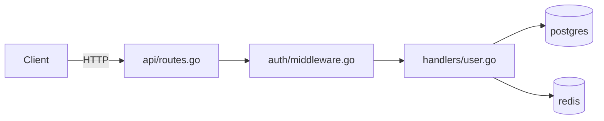
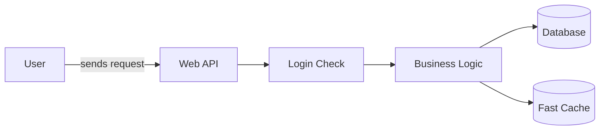

# Codebase Onboarding

Systematic orientation. Stop guessing. Build the right mental model before
touching anything — then keep it live as you work.

**How this works:** Claude runs the investigation — executes commands, reads
files, traces paths — and writes CODEBASE.md as a living orientation document.
The human provides the repository and answers questions that can't be found in
the code. Think of it as pair programming where Claude does the archaeology and
you provide context that only humans have.

---

## When to Use

| Situation | Mode |
|-----------|------|
| Joining a new team or repo for the first time | **join** |
| Returning to your own code after 3+ months away | **return** |
| Evaluating an OSS project before contributing | **audit** |
| About to modify a specific file mid-ramp | **touch** |
| About to push a PR — catch issues before review | **preflight** |
| Assigned a ticket or feature — map it to the codebase | **task** |

Default to **join** if unclear. `touch`, `preflight`, and `task` are ongoing
modes — they require an existing CODEBASE.md from a prior session.

---

## Intake: Ask First

Before running any orientation phase (join / return / audit), ask two questions.
The answers reshape every phase that follows.

### Question 1: Technical profile

Ask:

> "Are you a developer who can read code and run terminal commands, or are you
> non-technical — a PM, designer, analyst, or executive who needs to understand
> the system without diving into the code itself?"

Then explain the difference:

> **If you're technical:** I'll run shell commands, read source files, trace
> execution paths, and map git history. Output includes code snippets, file
> paths, and conventions — things you can act on directly. You'll also get a
> local dev guide and PR pre-flight support.
>
> **If you're non-technical:** I'll run all the same investigation but translate
> everything into plain language. No code in the output. You'll get a visual
> architecture diagram, priority-ranked questions for your next engineering
> meeting, and an executive brief you can share with stakeholders.

---

### Question 2: Goal

Wait for the answer to Question 1, then tailor the examples:

**If technical:**
> - Make a contribution or fix a specific bug
> - Take ownership — become the go-to maintainer
> - Review for quality, security, or architecture concerns
> - Evaluate an OSS project before contributing
> - Get up to speed after being away for months

**If non-technical:**
> - Understand what the system does and how it fits together
> - Assess risk before a launch, acquisition, or vendor decision
> - Identify what's slowing the team down
> - Have a more informed conversation with engineers
> - Prepare for a roadmap, sprint planning, or board conversation

---

**Profile + Goal → what changes:**

| Profile + Goal | What changes |
|----------------|-------------|
| Technical + contribute | Full workflow: Phases 0–7, local dev guide, Phase 8 |
| Technical + own/maintain | Full depth; extra attention to Danger Zones and authorship |
| Technical + review | Phases 0–6; security/quality lens; skip Phase 8 |
| Technical + evaluate OSS | audit mode — contributor signal, merge rate, PR velocity |
| Non-technical + understand | Phases 0–6; plain language; diagram; executive brief |
| Non-technical + decide | Phases 0–6 + recommendation section in executive brief |
| Non-technical + evaluate | audit mode; go/no-go framing in executive brief |

---

## Phase Order by Mode

| Phase | join | return | audit |
|-------|------|--------|-------|
| 0 — Bootstrap | ✓ first | ✓ first | ✓ first |
| 1 — Critical Paths | ✓ | ✓ | ✓ |
| 2 — Conventions | ✓ | ✓ after Phase 9 | ✓ |
| 3 — Danger Zones | ✓ | ✓ after Phase 9 | ✓ |
| 4 — Gotcha Detector | ✓ | ✓ | ✓ |
| 5 — Local Dev Guide | technical only | technical only | skip |
| 6 — Team Questions | technical: 1:1 format | technical: 1:1 format | technical: 1:1 format |
|                    | non-technical: meeting format | non-technical: meeting format | non-technical: meeting format |
| 7 — Executive Brief | non-technical only | non-technical only | non-technical only |
| 8 — First Contribution | technical only | technical only | skip |
| 9 — Archaeology | skip | ✓ before Phase 2 | skip |
| 10 — Contributor Signal | skip | skip | ✓ |

**In return mode:** run Phase 9 (Archaeology) immediately after Phase 1.

---

## Output: CODEBASE.md

```
CODEBASE.md
├── What This Is          # one-paragraph system description
├── Architecture Map      # Mermaid diagram + component description
├── Critical Paths        # entry points → processing → exit
├── Local Dev Guide       # technical only: step-by-step to get it running
├── Conventions           # implicit rules the README doesn't mention
├── Danger Zones          # what not to touch first, and why
├── Gotchas               # what silently burns new contributors
├── Team Questions        # technical: 1:1 format | non-technical: meeting format
├── Executive Brief       # non-technical only: one-page health summary
├── Open Questions        # still unclear — actively maintained
└── Contribution Log      # join/return: changes + learnings
                          # audit: merge rate, PR velocity, go/no-go
```

### Confidence calibration

Every section carries a confidence tag:

| Tag | Meaning |
|-----|---------|
| ✅ Verified | Based on CI config, git history, or explicit documentation |
| ⚠️ Inferred | Based on patterns — likely but not confirmed |
| ❓ Gap | Couldn't assess from code — needs human confirmation |

Gap sections automatically feed into Team Questions. If you wrote ❓, there
must be a corresponding question.

Update CODEBASE.md at the end of each phase. Do not defer.

---

## Phase 0: Bootstrap

```
1. README.md / README.rst    → what does it claim to do?
2. CLAUDE.md / AGENTS.md     → what has an AI already learned here?
3. CONTRIBUTING.md           → what does the team care about?
4. package.json / go.mod /
   pyproject.toml / Cargo.toml → language, deps, run scripts
5. Makefile / justfile        → available commands
6. .github/workflows/         → what CI runs — the ground truth
```

CI is the most honest documentation. If it conflicts with the README, CI wins.

```bash
ls -la && head -50 README.md
ls .github/workflows/ 2>/dev/null
grep -E "run:|script:" .github/workflows/*.yml 2>/dev/null | head -20
gh issue list --state open --limit 5 2>/dev/null
gh pr list --state open --limit 5 2>/dev/null
```

**Gate:** Write "What This Is" in CODEBASE.md with a confidence tag. One
paragraph, no jargon. Can't write it? Read more — don't proceed.

---

## Phase 1: Map the Critical Paths

```bash
# Entry points
find . -name "main.*" -o -name "index.*" -o -name "app.*" \
  | grep -v "node_modules\|.git\|test\|spec" | head -20

# What the system exposes
grep -rn "listen\|:8080\|:3000\|serve\|router\|@app.route" \
  --include="*.go" --include="*.ts" --include="*.py" -l | head -10

# Data stores
find . \( -name "*.sql" -o -name "schema.*" -o -type d -name "migrations" \) \
  ! -path "*/.git/*" | head -10
grep -rn "sqlite\|postgres\|mysql\|redis\|mongo" \
  --include="*.toml" --include="*.json" --include="*.env*" -l | head -10

# Monorepo
ls packages/ apps/ services/ 2>/dev/null | head -20
```

Trace each entry point one level deep: format in → transformation → format out.
Write **Critical Paths** and **Architecture Map** in CODEBASE.md.

### Architecture Map — generated for all users

**Technical users** (file paths, data flow):


**Non-technical users** (plain labels, same structure):


Cap at 10 nodes. The diagram is the most shareable artifact — a stakeholder
can paste it into Notion or a slide deck directly.

---

## Phase 2: Extract Conventions

```bash
git log --format="%s" -30
git log --format="%s" | grep -oE "^[a-z]+(\([^)]+\))?" | sort | uniq -c | sort -rn | head -10
git log --format="%s" | grep -i "test\|spec\|fix" | wc -l
git log --format="%s" | grep -i "wip\|todo\|tmp" | wc -l
git log --format=format: --name-only | grep -v "^$" | sort | uniq -c | sort -rn | head -15
git log --format="%ae" --follow -- src/ | sort | uniq -c | sort -rn | head -10
```

Extract what a contributor would get wrong without being told:
- Commit message format (conventional commits? ticket prefix? freeform?)
- PR size norm (focused or batched?)
- Test discipline (every commit touches tests, or separate?)
- Branch naming, squash vs merge, rebase policy

Write **Conventions** with a confidence tag. Prioritise implicit rules — the
README already covers the explicit ones.

---

## Phase 3: Map the Danger Zones

```bash
git log --format=format: --name-only | grep -v "^$" | sort | uniq -c | sort -rn | head -20
grep -rn "TODO\|FIXME\|HACK\|XXX" \
  --include="*.go" --include="*.ts" --include="*.py" --include="*.js" \
  | awk -F: '{print $1}' | sort | uniq -c | sort -rn | head -10
find . -type f \( -name "*.go" -o -name "*.ts" -o -name "*.py" -o -name "*.js" \) \
  ! -path "*/node_modules/*" ! -path "*/.git/*" ! -path "*/vendor/*" \
  -exec wc -l {} + 2>/dev/null | sort -rn | head -15
git log --format="%s" | grep -i "revert\|rollback" | head -10
```

Write **Danger Zones** as a table:

```
| File / Area         | Why dangerous                         | When to touch  |
|---------------------|---------------------------------------|----------------|
| src/core/engine.go  | 2,847 lines, 47 TODOs, in 89% of PRs | After 4+ weeks |
| migrations/         | Schema changes need team coordination | Never solo     |
| auth/               | No tests, last touched 18 months ago  | With review    |
```

---

## Phase 4: Gotcha Detector

**(all modes)**

Hunts for what silently burns every new contributor — not in the README, not
in the git log, not mentioned by anyone.

```bash
# Env vars in code but missing from .env.example
grep -rn "process\.env\." --include="*.ts" --include="*.js" -h \
  | grep -oE 'process\.env\.[A-Z_]+' | sort -u > /tmp/env_used.txt
grep -rn "os\.environ\|os\.Getenv" --include="*.py" --include="*.go" -h \
  | grep -oE '[A-Z_]{3,}' | sort -u >> /tmp/env_used.txt
grep -v "^#" .env.example .env.sample 2>/dev/null | cut -d= -f1 | sort > /tmp/env_documented.txt
comm -23 <(sort -u /tmp/env_used.txt) /tmp/env_documented.txt | head -10

# Pre-commit vs CI divergence
cat .pre-commit-config.yaml 2>/dev/null | grep -A1 "  - id:"
ls .git/hooks/ 2>/dev/null | grep -v "\.sample"

# Tests with global state (break when parallelised)
grep -rn "global\|singleton\|module.*cache\|shared.*state" \
  --include="*.test.*" --include="*_test.*" -l | head -10

# Unreferenced setup scripts
find . \( -name "setup.sh" -o -name "bootstrap.sh" -o -name "seed.sh" \
  -o -name "init.sh" \) ! -path "*/.git/*" ! -path "*/node_modules/*" 2>/dev/null \
  | while read f; do
      grep -ql "$(basename $f)" README.md CONTRIBUTING.md 2>/dev/null \
      || echo "UNREFERENCED: $f"
    done

# Port conflicts in tests
grep -rn "localhost\|127\.0\.0\.1\|:8080\|:3000" \
  --include="*.test.*" --include="*_test.*" -l | head -10
```

Write **Gotchas** — specific, not generic:

```markdown
## Gotchas ✅ Verified

- `STRIPE_WEBHOOK_SECRET` required but absent from `.env.example` —
  payments fail silently without it
- Pre-commit runs `eslint --fix`; CI runs `eslint` — passes locally,
  fails CI if you don't re-stage after the hook fires
- `auth/` tests share a singleton connection — `pytest -n 4` causes
  random failures; always run `pytest -p no:xdist auth/`
- `scripts/seed.sh` must run before tests — not in README; fails with
  a cryptic foreign key error if skipped
```

If nothing found: write `## Gotchas ✅ Verified — None found`. That's signal too.

---

## Phase 5: Local Dev Guide

**(technical users only — join and return modes)**

Synthesise everything found across Phases 0–4 into a step-by-step guide for
getting the codebase running locally. This is the document every new contributor
wishes existed on day one.

```bash
# Runtime requirements from manifests
cat package.json | python3 -c "import json,sys; d=json.load(sys.stdin); print(d.get('engines',''))" 2>/dev/null
cat .tool-versions 2>/dev/null    # asdf versions
cat .nvmrc 2>/dev/null            # Node version
cat .python-version 2>/dev/null   # Python version
cat go.mod 2>/dev/null | head -5  # Go version

# Docker / service dependencies
cat docker-compose.yml 2>/dev/null | grep -E "image:|ports:" | head -20

# Migration count and order
ls -1 migrations/ db/migrations/ 2>/dev/null | wc -l
ls -1 migrations/ db/migrations/ 2>/dev/null | head -5

# Available run scripts
cat package.json 2>/dev/null | python3 -c \
  "import json,sys; [print(k,':',v) for k,v in json.load(sys.stdin).get('scripts',{}).items()]" 2>/dev/null
grep -E "^[a-zA-Z].*:" Makefile 2>/dev/null | head -20
```

Write **Local Dev Guide** as an ordered list a new contributor can follow
verbatim. Every step must be a real command or a real instruction — no vague
"configure your environment" steps:

```markdown
## Local Dev Guide ✅ Verified

### Prerequisites
- Node.js 18+ (required by package.json engines)
- PostgreSQL 14+ (from docker-compose.yml)
- Redis 7+ (from docker-compose.yml)

### Setup
1. `cp .env.example .env`
2. Set these missing variables (not in .env.example — see Gotchas):
   - `STRIPE_WEBHOOK_SECRET` — ask alice@example.com for the dev key
   - `JWT_SECRET` — any 32-char random string works locally
3. `npm install`
4. `docker-compose up -d postgres redis`
5. `npm run db:migrate`         ← runs 47 migrations
6. `node scripts/seed.sh`       ← not in README; required for tests
7. `npm run dev`                → starts on http://localhost:3000

### Verify
`curl http://localhost:3000/health` → should return `{"status":"ok"}`

### Run tests
`npm test`                      ← what CI runs (not `make test` in README)
`pytest -p no:xdist auth/`      ← auth/ specifically (parallel breaks it)

### Common failures
- Migrations fail → PostgreSQL not running or DATABASE_URL not set
- Tests fail randomly → run auth/ without parallelism (see above)
- Stripe errors → STRIPE_WEBHOOK_SECRET missing from .env
```

---

## Phase 6: Team Questions

**(all modes — content varies by profile)**

Every phase surfaces things code can't answer. After Phases 1–5 (or Phase 9 in
return mode), review every ❓ Gap tag and every unexplained anomaly. Generate
the **Team Questions** section — format depends on profile.

### For technical users — 1:1 format

Three priority tiers. Criteria: blast radius if you get it wrong.

```
🔴 Blocking  — can't write safe code without this. Ask in the first hour.
🟡 Important — affects how you work this week. Ask in your first 1:1.
🟢 Nice-to-know — useful context, not urgent.
```

Questions must be specific — not "why is X like this" but "X has no tests and
was last touched 18 months ago — is that intentional or a known gap?"

**Example:**
```markdown
## Team Questions ✅ Verified

### 🔴 Blocking
1. `STRIPE_WEBHOOK_SECRET` is in code but not in `.env.example`. Shared
   dev key, or do I set up my own Stripe account?
2. CI runs `pytest -x`, README says `make test`. Which for local dev?

### 🟡 Important
3. `payments/sync.go` reverted 3× in 6 months — active fix, or avoided?
4. Auth has no tests, last touched 18 months ago — known gap or stable?

### 🟢 Nice-to-know
5. `core/engine.go` is 2,400 lines — plan to break it up, or intentional?
```

Aim for 2–4 blocking, 3–5 important, 2–4 nice-to-know. Under 5 total means
you weren't paying attention. Over 12 means you're not filtering.

### For non-technical users — meeting format

Generate questions framed for group settings, not a 1:1 with an engineer.
Group by the meeting type most relevant to the user's stated goal:

```markdown
## Team Questions ✅ Verified

### For your next sprint planning
- The payment module has broken and been reverted 3 times this year —
  is there work scheduled to fix it, and what's at risk if we ship
  features that touch it this sprint?
- Are there any areas the team is actively avoiding due to risk?

### For your next roadmap review
- Which parts of the system carry the most technical risk for our
  planned features — where are we most likely to hit unexpected slowdowns?
- Is there tech debt that needs investment before we can safely build X?

### For a board or investor conversation
- How would you describe the overall health of the engineering foundation?
- What's the one area of the codebase that worries the team most, and
  what's the plan for it?
```

---

## Phase 7: Executive Brief

**(non-technical users only — all modes)**

After Phase 6, synthesise all findings into a single-page document in business
language. This is what gets shared with directors, investors, or stakeholders
making decisions about this codebase.

No code. No file paths. No technical jargon. Every finding translated to
business impact.

**Format:**

```markdown
## Executive Brief ✅ Verified

### What this system does
[One sentence. What it does, who uses it, what it enables.]

### Codebase health summary

| Area | Status | Business impact |
|------|--------|----------------|
| Core engine | 🔴 High risk | Changes here are slow and bug-prone |
| Payments | 🟡 Unstable | Has broken 3× in 6 months; customer-facing risk |
| Authentication | 🟡 Untested | No safety net; bugs affect all users |
| API layer | 🟢 Healthy | Well-maintained, stable |

### Top risks — in plain language
1. **Payment instability:** The payment processing module has broken and
   been reverted three times in six months. Any new work touching payments
   carries a meaningful risk of customer-facing outage.
2. **Untested authentication:** Login and session management have no
   automated tests. Bugs here affect every user and are hard to catch
   before they reach production.
3. **Core engine debt:** The central processing layer has significant
   known debt. Adding features or fixing bugs there takes longer than
   it should and is prone to unexpected breakage.

### Recommended questions for your next engineering conversation
1. What's the plan for the payment instability — is there a fix in
   progress, and what's the timeline?
2. Is there a roadmap for adding test coverage to authentication?
3. Which debt area is costing the most in engineer time right now,
   and where should we invest first?

### Overall assessment
[One sentence: go/no-go, high/medium/low risk, or what needs to happen
before this codebase is ready for X — whatever matches the stated goal.]
```

---

## Phase 8: First Safe Contribution

**(technical users — join and return modes only)**

Find a specific candidate — file, line, fix — not just a category.

```bash
# Failing tests
npm test 2>&1 | grep -E "FAIL|✗|Error" | head -20
pytest --tb=no -q 2>&1 | grep -E "FAILED|ERROR" | head -20
go test ./... 2>&1 | grep -E "FAIL|panic" | head -20

# Lint / type errors
npm run lint 2>&1 | head -30
npx tsc --noEmit 2>&1 | head -30
golangci-lint run 2>&1 | head -30
ruff check . 2>&1 | head -30

# Good first issues
gh issue list --label "good first issue" --limit 10 2>/dev/null
gh issue list --label "help wanted" --limit 10 2>/dev/null

# Broken doc examples
grep -rn "^\`\`\`" docs/ README.md --include="*.md" -A5 \
  | grep -E "^\$ |^> " | head -20
```

Output: one candidate with file + line + what's wrong + fix + why it's safe.
Nothing found → say so explicitly.

```
✗ Refactor (too much blast radius)
✗ New feature (approach not clear yet)
✗ Anything in a Danger Zone
✗ Cleanup you don't fully understand yet
```

```bash
git diff --stat   # verify no Danger Zone files in the diff
```

Claude finds and drafts. Human runs CI, reviews, submits.

Write what was learned in **Contribution Log**.

---

## Phase 9: Archaeology

**(return mode only — run before Phases 2 and 3)**

```bash
git log --all --format="%ad %s" --date=short | head -40
find . -name "ADR*" -o -name "DECISION*" -o -path "*/docs/*.md" 2>/dev/null | head -10
git stash list
git log --all --oneline --decorate | head -20
find . -name "*.todo" -o -name "NOTES*" -o -name "SCRATCH*" 2>/dev/null
git log --format="%s" | grep -i "fix\|revert\|hotfix\|broke" | head -10
```

Add **Archaeology Notes** to CODEBASE.md:
- What you rediscovered that still makes sense
- What you'd do differently now
- What you found that surprised you

Then continue to Phase 2. Archaeology reframes what you'll see there.

---

## Phase 10: Contributor Signal

**(audit mode only)**

```bash
git log --format="%ad" --date=short | head -5
gh issue list --state open --limit 5
gh pr list --state open --limit 5
gh pr list --state closed --limit 20 | grep -v "MERGED"
gh pr list --state closed --json mergedAt,createdAt --limit 20 \
  | python3 -c "
import json,sys
from datetime import datetime
prs=json.load(sys.stdin)
for p in prs:
  if p['mergedAt']:
    c=datetime.fromisoformat(p['createdAt'].replace('Z','+00:00'))
    m=datetime.fromisoformat(p['mergedAt'].replace('Z','+00:00'))
    print(f'{(m-c).days}d')
" 2>/dev/null | sort -n
```

Add to CODEBASE.md: merge rate, average PR-to-merge time, maintainer
responsiveness, and go/no-go recommendation with reasoning.

---

## Touch Mode: Before You Modify Anything

**Requires an existing CODEBASE.md. Invoke at any time:**

> "I'm about to modify `[file or area]` — run touch mode."

```bash
git log --follow -20 --oneline -- [file]
git log --follow --format="%ae" -- [file] | sort | uniq -c | sort -rn | head -5
grep -n "TODO\|FIXME\|HACK\|XXX" [file] | head -10
grep -rn "[filename_without_ext]" --include="*.test.*" --include="*_test.*" -l | head -10
git log --follow --format="%s" -- [file] | grep -i "revert\|rollback" | head -5
grep -F "[file]" CODEBASE.md | head -5
```

**Output format:**

```
Before You Touch: auth/middleware.go

Risk level: HIGH — listed in Danger Zones

Recent commits:
  3 days ago   fix: token expiry edge case       alice@example.com
  2 weeks ago  REVERT: "refactor auth flow" — broke staging
  1 month ago  fix: race condition in session validation

Who to ping: alice@example.com (14 of last 20 commits here)

Known issues:
  Line 47   TODO  refresh token rotation not implemented
  Line 203  FIXME breaks with multiple active sessions

Tests covering this:
  tests/auth/middleware_test.go
  tests/integration/session_test.go

Watch out for:
  Session singleton on line 89 has non-obvious global state —
  this is what caused the revert two weeks ago
```

---

## Preflight Mode: Before You Push

**Requires an existing CODEBASE.md. Invoke before opening a PR:**

> "Run preflight on my current changes."

```bash
# What's in the diff?
git diff HEAD --name-only
git diff HEAD --stat

# Commit message
git log --format="%s" -1

# Tests in the diff?
git diff HEAD --name-only | grep -iE "test|spec" | head -10
git diff HEAD --name-only | grep -viE "test|spec" | head -10

# Who last owned the touched files?
for f in $(git diff HEAD --name-only); do
  echo "--- $f ---"
  git log --follow --format="%ae" -- "$f" | sort | uniq -c | sort -rn | head -3
done
```

Cross-reference findings against CODEBASE.md and output a pre-flight report:

```
PR Pre-flight: feat/add-rate-limiting

✅ Commit message follows conventional commits format
✅ No Danger Zone files in the diff
⚠️  auth/middleware.go touched — alice@example.com should review (14 of last 20 commits)
❌ No test changes for modified source files (convention: every commit touches tests)
⚠️  payments/ touched — review Gotcha: pre-commit runs eslint --fix, CI does not

Suggested reviewers:
  alice@example.com  → auth/middleware.go
  bob@example.com    → api/routes.go

Conventions check:
  ✅ Branch name matches pattern (feat/*)
  ✅ Commit is focused (4 files — within team norm)
  ❌ Missing test coverage for changed files

Overall: ⚠️ ADDRESS BEFORE PUSHING
  → Add tests for changed files
  → Re-stage after pre-commit hook fires (eslint --fix)
```

Preflight catches what reviewers would catch — before review. One ❌ means fix
it. One ⚠️ means be aware. All ✅ means push with confidence.

---

## Task Mode: Map a Ticket to the Codebase

**Requires an existing CODEBASE.md. Invoke when starting any new piece of work:**

> "I've been assigned to add rate limiting to the API."
> "I need to fix the payment retry logic — what do I need to know?"
> "I'm picking up ticket #47 — where do I start?"

Task mode maps intent to the codebase using CODEBASE.md as the lens:

1. **Identify relevant files** — from Architecture Map and Critical Paths, where does this work live?
2. **Flag proximity to Danger Zones** — is the work adjacent to anything risky?
3. **Surface applicable conventions** — what does the team's pattern say about how to do this?
4. **Find similar past work** — has this been done before? Who did it?
5. **Identify who to loop in** — from authorship and expertise signals

```bash
# Has this kind of work been done before?
git log --format="%s %h" | grep -i "[keyword from task]" | head -10

# Who touched the relevant area last?
git log --follow --format="%ae" -- [relevant path] | sort | uniq -c | sort -rn | head -5

# Any open issues related?
gh issue list --search "[keyword]" --limit 5 2>/dev/null
```

**Output format:**

```
Task: Add rate limiting to the API

Relevant files:
  api/routes.go         — entry point; rate limiting hooks here
  api/middleware.go     — existing middleware pattern to follow ← start here

Danger Zone proximity:
  auth/middleware.go    ⚠️  adjacent — avoid touching unless necessary

Similar past work:
  "feat(api): add request logging middleware" — 3 months ago, bob@example.com
  Follow the same pattern: middleware.go, not routes.go

Conventions that apply:
  Every new middleware needs an integration test in tests/api/
  Middleware naming: [action]Middleware (e.g. rateLimitMiddleware)

Who to loop in:
  bob@example.com — built existing middleware, owns api/ (last 20 commits)

Risk level: LOW
  api/ is not a Danger Zone. Pattern is established. Bob can review.

Suggested first step:
  Read api/middleware.go (the logging middleware) — it's the template
  for what you're about to build.
```

---

## Keeping CODEBASE.md Current

Run when the codebase feels like it's drifted:

```bash
# What changed since CODEBASE.md was last updated?
git log --since="$(git log --follow -- CODEBASE.md \
  --format='%ad' --date=short | head -1)" \
  --format=format: --name-only | grep -v "^$" \
  | sort | uniq -c | sort -rn | head -20

# Danger Zones touched?
git log --since="2 weeks ago" -- src/core/ auth/ migrations/ --oneline | head -10

# CI changed?
git log --since="2 weeks ago" -- .github/workflows/ --oneline | head -5

# New large files?
find . -type f \( -name "*.go" -o -name "*.ts" -o -name "*.py" \) \
  ! -path "*/node_modules/*" ! -path "*/.git/*" \
  -newer CODEBASE.md -exec wc -l {} + 2>/dev/null | sort -rn | head -10
```

**Update when:** Danger Zone modified heavily, CI changed, new large file appeared,
new contributor joined, conventions visibly violated in recent PRs.

**Cadence:** weekly first month, monthly after.

---

## Common Rationalizations

| Rationalization | Reality |
|----------------|---------|
| "I'll start coding and learn as I go" | You'll violate conventions you haven't discovered yet and waste a review cycle |
| "The README explains everything" | The README explains intentions. Git log explains reality. They often conflict |
| "I know this stack, I know how it works" | Every codebase has implicit rules the stack doesn't enforce |
| "I'll read all the code first, then start" | You'll never start. Map critical paths, not the whole codebase |
| "This code is messy, I should clean it up" | You don't understand it yet. Cleanup before understanding = silent breakage |
| "I can see what this does, I don't need CODEBASE.md" | You'll forget. You'll also hand it to the next person who joins |
| "I'll skip the local dev guide, I'll figure it out" | You'll spend 3 hours on a missing env var that's already in the Gotchas section |
| "I'll think of questions as they come up" | You won't — you'll be heads-down in code |
| "I don't need preflight, I've read the conventions" | Your mental model of conventions is probabilistic. Preflight is deterministic |
| "I know what this ticket needs, I don't need task mode" | You know the feature. You don't know which files to avoid |

---

## Red Flags

- Making changes before completing Phase 0
- Skipping the local dev guide and spending hours on setup instead
- First contribution touches a Danger Zone
- Team Questions are generic ("why is X written this way?") not specific
- Team Questions have no priority tiers — everything looks equally urgent
- Executive Brief uses technical jargon — if an exec can't read it, rewrite it
- CODEBASE.md sections have no confidence tags
- Pushing a PR without running preflight when touching a Danger Zone
- Starting a task without running task mode when the scope is unclear
- Abandoning CODEBASE.md after week one — it becomes more valuable as it grows
- Running return mode in join order — skipping archaeology misreads conventions

---

## Verification

**Core (all modes):**
- [ ] Can describe what the system does in one paragraph without looking at README
- [ ] Can trace a request from entry point to exit
- [ ] Architecture Map contains a Mermaid diagram (plain labels for non-technical)
- [ ] Every CODEBASE.md section has a confidence tag (✅ / ⚠️ / ❓)
- [ ] Gotchas section present — even if "none found"
- [ ] Danger Zones listed with reasons and "when to touch" guidance
- [ ] Open Questions section exists and is non-empty

**Technical users:**
- [ ] Local Dev Guide is an ordered list of real commands — no vague steps
- [ ] Local Dev Guide includes "verify it works" check
- [ ] Team Questions: 3 tiers, 5–12 questions total, all specific
- [ ] Phase 8 produced file + line + fix — not a category

**Non-technical users:**
- [ ] Architecture diagram uses plain language labels
- [ ] Team Questions framed for group meetings, not 1:1s
- [ ] Executive Brief has no code, no file paths, no jargon
- [ ] Executive Brief ends with a clear overall assessment

**return mode:**
- [ ] Archaeology Notes explains key decisions and what surprised you
- [ ] Phase 9 ran before Phase 2

**audit mode:**
- [ ] Merge rate and PR-to-merge time documented
- [ ] Go/no-go decision with explicit reasoning

**Ongoing modes:**
- [ ] Touch: risk level assessed before any Danger Zone modification
- [ ] Preflight: run before every PR that touches Danger Zones or lacks tests
- [ ] Task: relevant files, Danger Zone proximity, and reviewer identified before starting
